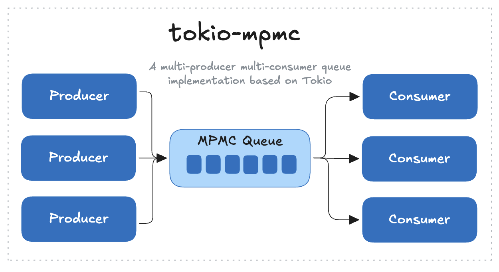

# tokio-mpmc

[](https://crates.io/crates/tokio-mpmc)
[](https://docs.rs/tokio-mpmc)
[](https://opensource.org/license/apache-2-0)
[](https://github.com/lispking/tokio-mpmc/actions?query=branch%3Amain)

A high-performance multi-producer multi-consumer (MPMC) queue implementation based on Tokio.



## Features

- Asynchronous implementation based on Tokio
- Support for multi-producer multi-consumer pattern
- Message processing using consumer pool
- Simple and intuitive API
- Complete error handling
- Queue capacity control

## Installation

Add the following dependency to your `Cargo.toml`:

```toml
[dependencies]
tokio-mpmc = "0.1"
```

## Usage Example

```rust
use tokio_mpmc::Queue;

#[tokio::main]
async fn main() {
    // Create a queue with capacity of 100
    let queue = Queue::new(100);

    // Send a message
    if let Err(e) = queue.send("Hello").await {
        eprintln!("Send failed: {}", e);
    }

    // Receive a message
    match queue.receive().await {
        Ok(Some(msg)) => println!("Received message: {}", msg),
        Ok(None) => println!("Queue is empty"),
        Err(e) => eprintln!("Receive failed: {}", e),
    }

    // Close the queue
    queue.close().await;
}
```

## API Documentation

Main APIs include:

- `Queue::new(capacity)` - Create a new queue
- `Queue::send(value)` - Send a message
- `Queue::receive()` - Receive a message
- `Queue::close()` - Close the queue
- `Queue::len()` - Get queue length
- `Queue::is_empty()` - Check if queue is empty
- `Queue::is_full()` - Check if queue is full
- `Queue::is_closed()` - Check if queue is closed

## Performance

```bash
cargo criterion --message-format=json | criterion-table > BENCHMARKS.md
```

### Benchmark Results

|              | `tokio-mpmc`              | `flume`                           |
|:-------------|:--------------------------|:--------------------------------- |
| **`non-io`** | `649.09 us` (✅ **1.00x**) | `768.68 us` (❌ *1.18x slower*)    |
| **`io`**     | `191.51 ms` (✅ **1.00x**) | `215.82 ms` (❌ *1.13x slower*)    |

> **Note**: `non-io` means no IO operation, `io` means IO operation.

> See [benchmark code](./benches/queue_benchmark.rs)

## License

This project is licensed under the Apache-2.0 License. See the [LICENSE](LICENSE) file for details.
